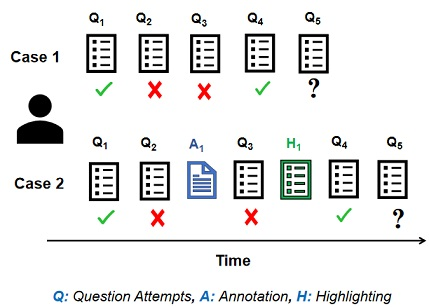
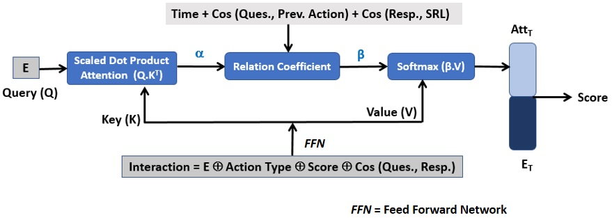

# Predictive Student Modelling in an Online Reading Platform
Code for paper: [Predictive Student Modelling in an Online Reading Platform](https://effat.github.io/webdata/EAAI_CameraReady_preprint.pdf)  
Effat Farhana, Teomara Rutherford, Collin F. Lynch  
[EAAI@AAAI 2022] 
The main objective of this project is to predict students' performance on a question given **temporal ordering** of *question attempts* and *learning activities* within a K-12 online reading platform, Activle Learn (AL).

# Overview
  

Predicting a student's performance on a question given prior question attempts is known as knowledge tracing (KT) in educational application. 

Existing KT approaches consider a student's prior sequential question attempts to predict their future score on a question Q5 **(Case 1)**.
However, student may perform other *learning activities* within the system. **Case 2** illustrates such a scenario where a student performed one highlighting and one annotation prior attempting Q5. 

Our proposed transformer-based apporach can handle both **Case 1** and **Case 2** scenarios. We argue that to fully understand
students’ performance on a question, we need to
consider (i) that their question-solving and other learning activities may influence learning and (ii) how these behaviors
are related to the question attempt.

Consulting learning science literature, we identified self-regulated learning (SRL) activities--which include planning and monitoring activities during learning. More specifically, we combine three reading-realed SRL actions *in-situ* within the AL platform, namely, annotating, highlighting, and vocabulary lookup in our KT model.

# Model Architecture
  

1. The **Interaction Vector** comprises of (i) textual content embedding of question (annotated/highlighted/ vacbulary looked up), (ii)action type encoding, (iii) score representation, and (iv) similarity measure of current question and response text. 

2. The interaction vector serves as the Key and Value vector in our transformer model. The Query vector is textual content embedding of current question (E).

3. Our model uses scaled dot product attention. In addition, we add three components in our attention mechanism
    a) Exponetial time-decaying relationship to put more weight on recent action and less on distant ones. This component mimics forgetting behavior of human memore.
    b) Discover semantic relationship between the current question and a previously attempted (i) question or (ii) SRL actions
    c) Discover semantic relationship between the the current question's response and a previously attempted SRL actions. (To understand: Are students' using their highlighted/ annotated text in responding to a question?) 

4. The prediction layer predicts the score of the current question.